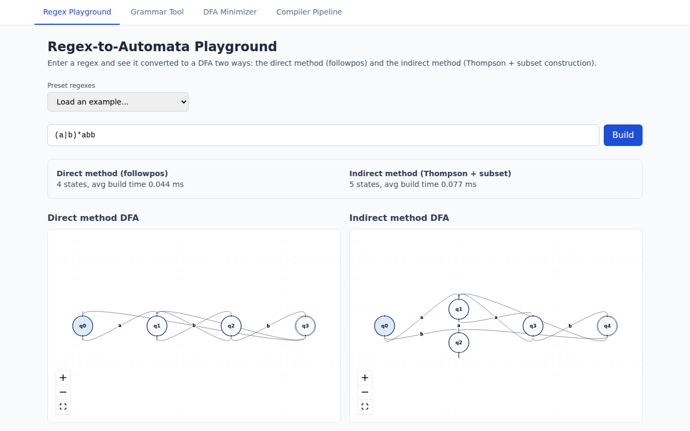
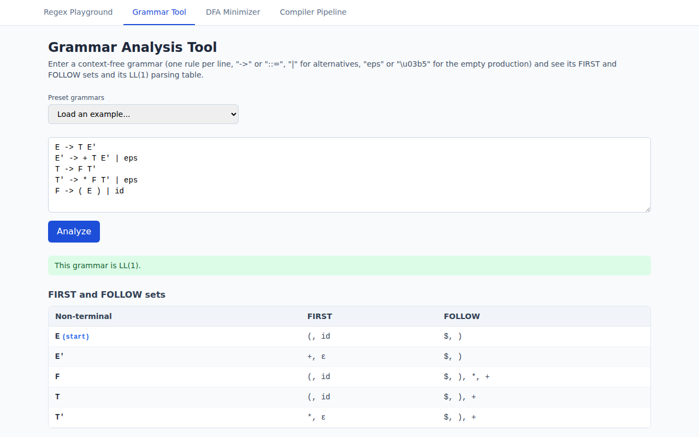
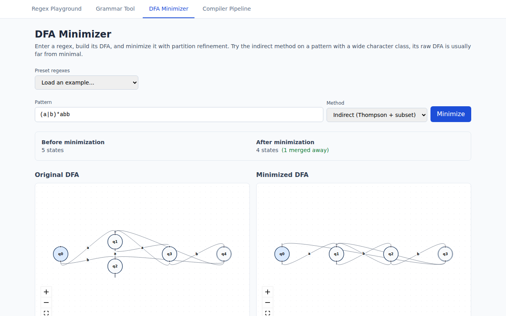
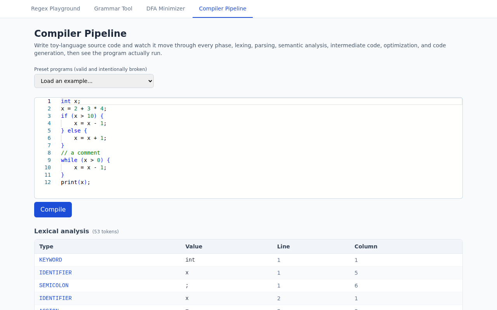
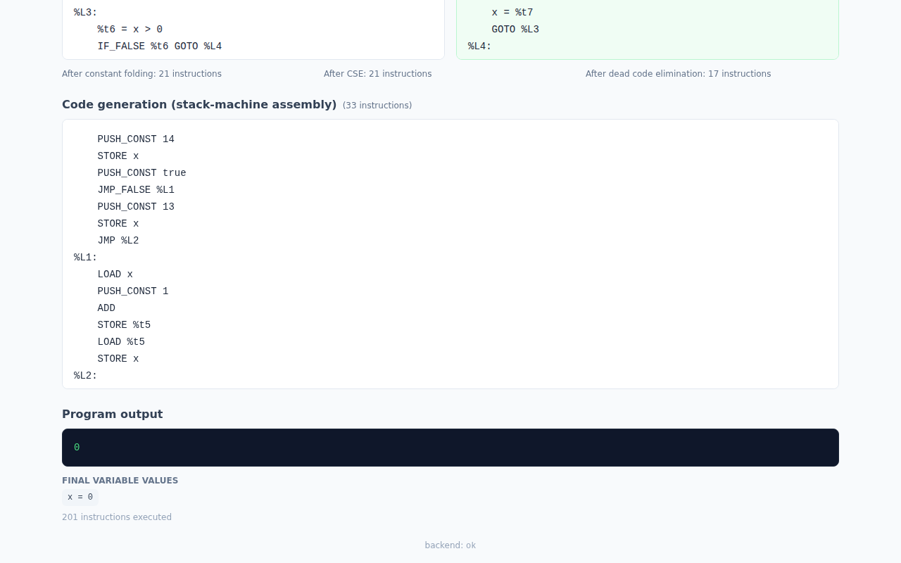

# CompileViz

**Live demo:** https://compile-viz.vercel.app
**Backend API docs:** https://compileviz.onrender.com/docs

An interactive web platform for visualizing compiler construction
concepts: a regex-to-automata playground (direct followpos method vs.
indirect Thompson + subset construction), a grammar analysis tool
(FIRST/FOLLOW, LL(1)), DFA minimization, and a full six-phase toy-
language compiler with a live visualization dashboard, all the way
from source code to an actual running program.

Built for BCSE307P (Compiler Design Lab), VIT Vellore.

> The backend is hosted on Render's free tier, which spins down after
> 15 minutes of inactivity. If the demo link seems slow to respond the
> first time, that's the server waking up (30-60 seconds), not a bug,
> give it a moment and it'll be fast from then on.

## Project status: complete

Every milestone on `docs/ROADMAP.md` is done, all four tools below are
live and working end to end.

## Screenshots

### Regex-to-Automata Playground
Direct-method and indirect-method DFA construction, side by side, with
a state-count and build-time comparison.



### Grammar Analysis Tool
FIRST/FOLLOW sets and the LL(1) parsing table for a user-supplied
grammar, with conflicts highlighted directly in the table.



### DFA Minimizer
Partition refinement, with the original and minimized automata shown
side by side.



### Compiler Pipeline
All six classical phases, lexing, parsing, semantic analysis,
intermediate code, optimization, and code generation, live from one
Monaco editor, with inline error highlighting and a preset library.




## Repo structure

```
backend/    FastAPI + Python: automata engines, grammar tools, and the
            toy-language compiler pipeline
frontend/   React (Vite) + Tailwind + Monaco: the dashboard and
            playground UI
docs/       Architecture notes, roadmap, deployment guide, screenshots
```

## Running locally

### Backend

```bash
cd backend
python -m venv .venv
source .venv/bin/activate      # on Windows: .venv\Scripts\activate
pip install -r requirements.txt
uvicorn app.main:app --reload
```

The API runs at `http://localhost:8000`, with interactive docs at
`http://localhost:8000/docs`.

### Frontend

```bash
cd frontend
npm install
npm run dev
```

The app runs at `http://localhost:5173` and shows the backend
connection status in the footer.

### Running tests

```bash
cd backend
pytest -v
```

CI runs this automatically on every pull request into `main`.

## Deployment

The live demo above is hosted on Render (backend) and Vercel
(frontend). See `docs/DEPLOYMENT.md` for the full setup guide if
you're deploying your own copy.

## Contributing workflow

Every feature is built on its own branch and merged into `main`
through a pull request. See `docs/CONTRIBUTING.md` for the exact
convention.

## License

MIT, see `LICENSE`.
